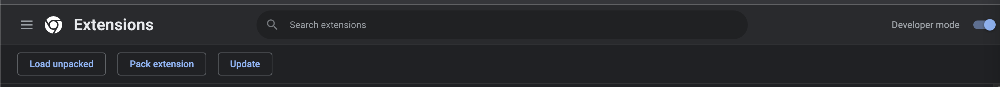
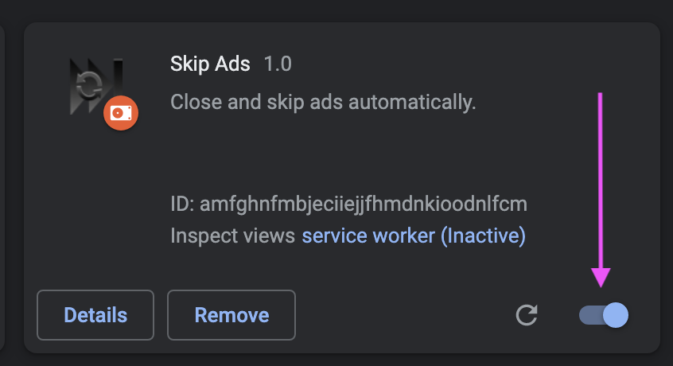
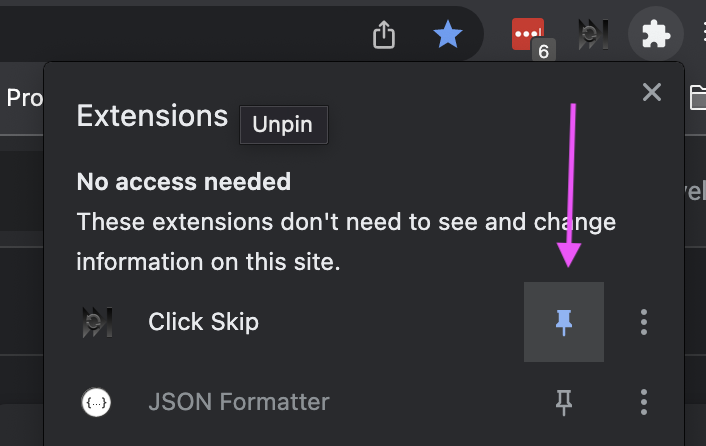

# How to use (at your own risk)

I'm likely never gonna bother publishing this.
Use at your own risk. (just read the code, its minimal)

- Go to [chrome://extensions/](chrome://extensions/)
- Turn on developer mode

- Click Load unpacked
- Select this repo. 
- Enable the extension

- Pin the extensions (for easier turning on and off)

