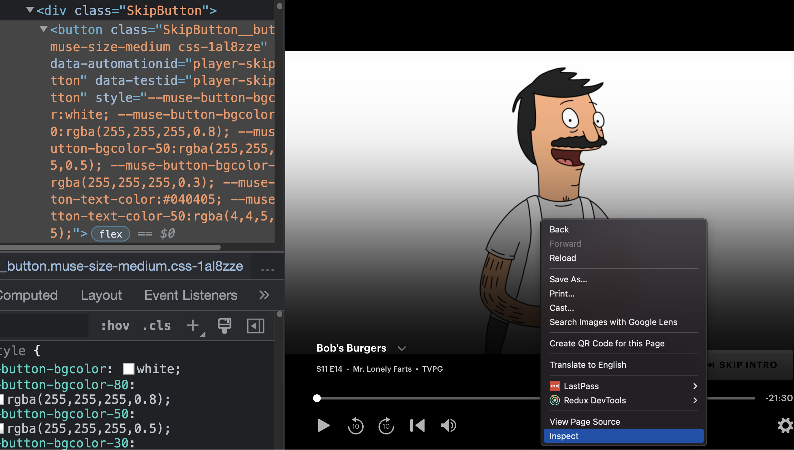

# Button Clicker

Button click, uses a query to search a container for changes.  If a button appears, it will click it. I've set it up with a couple, that i like, and find annoying.  With minimal tweaking, you could have it delete content, or run code javascript.
## How to use (at your own risk)

I'm likely never gonna bother publishing this.
Use at your own risk. (just read the code, its minimal)

- Go to [chrome://extensions/](chrome://extensions/)
- Turn on developer mode

- Click Load unpacked
- Select this repo. 
- Enable the extension

- Pin the extensions (for easier turning on and off)


## How to add new button selectors to click

- To open and close the [chrome dev tools](https://developer.chrome.com/docs/devtools/) open cmd-shift-i mac, otherwise ctrl-shift-i.
- You can also right click (ctrl-right-click) and click inspect, to go directly to the element info.
- Double click on the css (in inspector) and copy the class name.

<details> <summary>Click to expand screenshots</summary>

 

</details>

In this example, it was
 
 `class="SkipButton__button muse-size-medium css-1al8zze",`

 
- You've got the clickable selector.  Use `SkipButton__button` as that's the most specific.  

- Go a up a couple parents, and find one.  I you could just add "body", but then it would run constantly.  So try to find a closer parent, that doesn't disappear.  Trial and error was my technique.  

- Once you got the `containerSelector`, add a new object to the listOfSites.

e.g.

```
  {
    urlSearchString: 'hulu.com',
    containerSelector: '.ControlsContainer',
    clickableSelectors: [
      'SkipButton',
      '.SkipButton__button',
      '[data-automationid="player-skip-button"]',
    ],
  },
```


